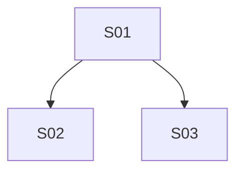

# Backlog mestre — [NOME_DO_PROJETO_OU_FEATURE]

Backlog macro de **[NOME_DO_PROJETO_OU_FEATURE]**.

Este arquivo é **índice estratégico + estado consolidado**. Ele organiza fases, sprints, dependências, prioridade e próxima sprint executável. O detalhe vivo de cada sprint mora em `SPRINT_S<NN>_<slug>.md`; o PRD e o PLAN nascem depois, recortados por sprint.

Use este template para transformar conversa, ideia, briefing, roadmap ou PRD macro em uma sequência pequena, rastreável e executável pelo Atlas.

---

## 1. Contrato documental

### 1.1 Papel de cada artefato

| Artefato | Papel | Não deve conter |
|---|---|---|
| Backlog mestre | Estratégia macro, índice de sprints, estado e dependências | Critério completo de aceite, plano técnico, logs de execução |
| Sprint file | Escopo vivo da sprint, DoR/DoD, riscos, gates, links, `eval_manifest` | Implementação detalhada task-a-task |
| PRD da sprint | Produto, comportamento, decisões e aceite de negócio | Classes, comandos, paths técnicos |
| PLAN da sprint | Execução técnica, tasks, invariantes, validação local | Macro roadmap, decisões de produto duplicadas |
| State file | Evidência factual de execução/validação | Planejamento novo ou justificativa retrospectiva |

### 1.2 Precedência em conflito

1. Decisões formais aprovadas: [link/arquivo]
2. Contratos externos/backend/specs: [link/arquivo]
3. PRD da sprint corrente: [link/arquivo]
4. Sprint file corrente: [link/arquivo]
5. Este backlog mestre
6. Notas exploratórias/rascunhos: [link/arquivo]

Observações:

- Backlog não cria regra de negócio sozinho.
- Sprint file é a ponte entre macro e PRD.
- PRD aprovado vence sprint file em produto/aceite.
- PLAN aprovado vence sprint file em execução técnica.
- Toda divergência relevante deve virar decisão registrada ou bloqueio.

---

## 2. Metadados

| Campo | Valor |
|---|---|
| Produto / feature | [nome] |
| Status | [draft / ativo / pausado / concluído / arquivado] |
| Responsável | [papel/nome] |
| Data de criação | [YYYY-MM-DD] |
| Última atualização | [YYYY-MM-DD] |
| Fonte macro | [conversa / briefing / roadmap / PRD macro / issue / doc] |
| Diretório recomendado de sprints | `.atlas/backlog/sprints/` |
| Próxima sprint executável | [SNN ou `nenhuma`] |

---

## 3. Objetivo macro

**Resultado final esperado:** [resultado de produto/operação em uma frase]

### Resultados esperados

- [ ] [resultado macro 1]
- [ ] [resultado macro 2]
- [ ] [resultado macro 3]

### Fora do ciclo atual

- [ ] [fora de escopo macro 1]
- [ ] [fora de escopo macro 2]
- [ ] [fora de escopo macro 3]

---

## 4. Princípios de decomposição

1. Macro fica no backlog; execução fica na sprint.
2. Cada sprint tem objetivo único, pequeno e testável.
3. Sprint grande deve ser quebrada antes de PRD/PLAN.
4. Dependência bloqueante precisa ter dono, status e ação.
5. `Must` sem dependência pronta não fura fila por urgência verbal.
6. PRD só nasce de sprint file/`sprint` recortado (`backlog-item` é alias legado).
7. PLAN só nasce de PRD aprovado + leitura do código real.
8. Evidência vence narrativa: claim importante precisa apontar para artefato, gate ou state.
9. Aprendizado entre sprints entra no sprint file/backlog, não em memória solta.
10. Decisão fechada não é reaberta sem registro histórico.

---

## 5. Estados e gates

### 5.1 Estados de sprint

`backlog → ready → doing → review → done`

Estado lateral: `blocked`.

| Estado | Significado | Pode gerar PRD? | Pode executar? |
|---|---|---:|---:|
| backlog | Identificada, ainda sem DoR verde | não | não |
| ready | DoR verde e dependências satisfeitas | sim | após PRD/PLAN |
| doing | Em execução | não gerar novo PRD sem decisão | sim |
| review | Implementada, aguardando validação/revisão | não | não mutar fora repair |
| done | DoD verde e evidência registrada | não | não |
| blocked | Bloqueada por decisão/dependência | não | não |

### 5.2 Definition of Ready global

- [ ] Sprint file existe e está linkado no backlog.
- [ ] Objetivo único.
- [ ] Dependências anteriores `done` ou explicitamente não bloqueantes.
- [ ] Bloqueadores críticos resolvidos ou com decisão registrada.
- [ ] Escopo/fora de escopo claros.
- [ ] `eval_manifest` mínimo definido no sprint file.
- [ ] Próxima ação determinística registrada.

### 5.3 Definition of Done global

- [ ] PRD aprovado, quando aplicável.
- [ ] PLAN executado, quando aplicável.
- [ ] Validator frio concluído.
- [ ] Evidências/state linkados no sprint file.
- [ ] Status do sprint file e do backlog sincronizados.
- [ ] Aprendizados/decisões relevantes registrados.

---

## 6. Decisões e bloqueios

### Decisões bloqueantes

Use esta tabela para decisões que impedem uma ou mais sprints de ficarem `ready`.

| ID | Decisão | Bloqueia | Dono | Status |
|---|---|---|---|---|
| D1 | [decisão] | [SNN/DEP] | [pessoa/time] | [pendente/decidido] |

### Dependências externas

| ID | Dependência | Bloqueia | Dono | Status | Ação |
|---|---|---|---|---|---|
| DEP-001 | [contrato/API/acesso/decisão] | SNN | [dono] | [open/done/blocked] | [ação] |

---

## 7. Registro de sprints

Uma linha por sprint. Detalhe vivo no arquivo apontado em **Sprint file**.

As 12 primeiras colunas preservam compatibilidade com helpers Atlas atuais. Colunas novas entram no fim.

| ID | Sprint | Fase-fonte | Objetivo (1 linha) | MoSCoW | Ganho | Esforço | Prioridade | PRD | Depende de | Estado | Gate | Sprint file | PLAN | State |
|---|---|---|---|---|---|---|---|---|---|---|---|---|---|---|
| S01 | [nome] | F0 | [objetivo curto] | Must | Alto | Baixo | P0 | pendente | — | backlog | — | `.atlas/backlog/sprints/SPRINT_S01_[slug].md` | pendente | pendente |
| S02 | [nome] | F1 | [objetivo curto] | Must | Alto | Médio | P0 | pendente | S01 | backlog | — | `.atlas/backlog/sprints/SPRINT_S02_[slug].md` | pendente | pendente |
| S03 | [nome] | F1 | [objetivo curto] | Should | Médio | Baixo | P1 | pendente | S01 | backlog | — | `.atlas/backlog/sprints/SPRINT_S03_[slug].md` | pendente | pendente |

Legenda:

- **Fase-fonte:** `F0 discovery`, `F1 especificação`, `F2 contrato/infra`, `F3 implementação`, `F4 hardening`, `F5 release`.
- **MoSCoW:** `Must`, `Should`, `Could`, `Won't now`.
- **Ganho/Esforço:** `Alto`, `Médio`, `Baixo`.
- **Prioridade:** `P0`, `P1`, `P2`, `P3`.
- **Gate:** último gate relevante ou `—`.
- **Sprint file/PLAN/State:** paths vivos ou `pendente`.

---

## 8. Seleção da próxima sprint

### 8.1 Regra determinística

1. Filtrar sprints com dependências satisfeitas.
2. Filtrar sprints com sprint file existente.
3. Filtrar sprints com DoR global verde.
4. Ordenar por MoSCoW: `Must` → `Should` → `Could`.
5. Dentro da mesma classe, priorizar maior ganho e menor esforço.
6. Em empate, escolher a que reduz maior risco ou desbloqueia mais sprints.
7. Registrar decisão em `8.2`.

### 8.2 Próxima sprint executável

| Campo | Valor |
|---|---|
| Sprint escolhida | [SNN] |
| Motivo | [por que esta sprint vence pelas regras acima] |
| Dependências satisfeitas | [sim/não + resumo] |
| Sprint file | [path] |
| Próxima ação | [gerar PRD / atualizar sprint file / resolver bloqueio / executar PLAN] |

---

## 9. Grafo de dependências

### 9.1 Grafo

## 10. Decisões macro

Decisões que mudam sequência, escopo macro, prioridade ou contrato entre sprints.

| ID | Decisão | Impacto | Data | Status |
|---|---|---|---|---|
| DEC-001 | [decisão] | [sprints afetadas] | [YYYY-MM-DD] | [proposta/aprovada/revertida] |

---

## 11. Riscos macro

| ID | Risco | Afeta | Prob. | Impacto | Mitigação | Status |
|---|---|---|---|---|---|---|
| R-001 | [risco] | [SNN/fase] | [baixa/média/alta] | [baixo/médio/alto] | [mitigação] | [open/monitorado/fechado] |

---

## 12. Progresso

| Fase | Sprints | Done | Doing/Review | Blocked | Restante |
|---|---:|---:|---:|---:|---:|
| F0 discovery | [n] | [n] | [n] | [n] | [n] |
| F1 especificação | [n] | [n] | [n] | [n] | [n] |
| F2 contrato/infra | [n] | [n] | [n] | [n] | [n] |
| F3 implementação | [n] | [n] | [n] | [n] | [n] |
| F4 hardening | [n] | [n] | [n] | [n] | [n] |
| F5 release | [n] | [n] | [n] | [n] | [n] |

---

## 13. Protocolo de atualização

Atualizar este backlog quando:

- nova sprint for criada, quebrada, bloqueada ou concluída;
- prioridade/dependência mudar;
- PRD/PLAN/state nascer ou mudar de path;
- sprint file mudar status;
- decisão macro alterar sequência.

Não atualizar este backlog para:

- listar tasks técnicas do PLAN;
- copiar critérios completos do PRD;
- registrar logs detalhados de execução;
- guardar achados que pertencem só a uma sprint.

---

## 14. Contratos anti-drift

- IDs de sprint são imutáveis após publicados.
- Sprint `done` não muda escopo sem nova sprint ou registro histórico explícito.
- Status do backlog e do sprint file devem bater.
- Todo `Depende de` referencia sprint existente ou `DEP-*`.
- Todo PRD/PLAN listado deve existir ou estar marcado como `pendente`.
- Toda sprint `ready` precisa ter sprint file linkado.
- Entrada macro não gera PRD direto; primeiro vira backlog + sprint file.

---

## 15. Histórico

| Data | Autor | Mudança |
|---|---|---|
| [YYYY-MM-DD] | [nome/agente] | Criação do backlog mestre |
