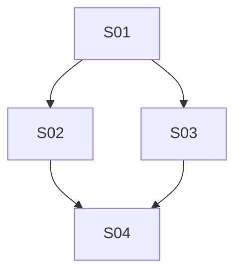

# Backlog mestre — [NOME_DO_PROJETO_OU_FEATURE]

Plano macro de desenvolvimento de **[NOME_DO_PROJETO_OU_FEATURE]**. Este arquivo organiza **fases de entrega**, **sprints executáveis**, decisões de sequência, gates e critérios de aceite. Ele não substitui visão de produto, specs técnicas, contratos backend, documentação de arquitetura ou decisões formais aprovadas.

Este backlog funciona como **índice e fonte de estado das sprints**. O detalhe de cada sprint vive no **PRD específico da sprint** (`PRD_TEMPLATE.md`), nunca duplicado aqui. As fases (seções 9 a 15) são um **catálogo de tasks-modelo** reutilizável que alimenta as sprints — não são execução direta.

Use este template como base para qualquer roadmap/backlog mestre. Substitua todos os placeholders entre colchetes antes de considerar o documento pronto.

---

## 1. Precedência documental

Quando houver conflito, seguir esta ordem:

1. **Decisões formais aprovadas**: [link/arquivo]
2. **Visão de produto / PRD macro / requisitos**: [link/arquivo]
3. **Specs técnicas / contratos backend / OpenAPI**: [link/arquivo]
4. **PRD da sprint corrente** (`PRD_S<NN>_*.md`): [link/arquivo]
5. **Guia geral da feature/projeto**: [link/arquivo]
6. **Este backlog mestre**
7. **Notas exploratórias, checklists e rascunhos**: [link/arquivo]

Observações:

- Este backlog organiza execução e estado; não cria regra de negócio sozinho.
- Qualquer mudança de produto deve atualizar primeiro a fonte canônica de produto.
- Qualquer mudança de contrato deve atualizar primeiro a spec/contrato canônico.
- Detalhe de execução de uma sprint mora no PRD dela; o backlog só aponta e registra status.

---

## 2. Objetivo do backlog

Descrever em fases e sprints tudo que precisa ser descoberto, especificado, implementado, validado e publicado para entregar **[RESULTADO_FINAL_ESPERADO]**.

### Resultado esperado

- [ ] [Resultado principal 1]
- [ ] [Resultado principal 2]
- [ ] [Resultado principal 3]

### Fora do escopo

- [ ] [Item explicitamente fora do escopo 1]
- [ ] [Item explicitamente fora do escopo 2]
- [ ] [Item explicitamente fora do escopo 3]

---

## 3. Princípios do backlog

1. **Fase só avança com critério de pronto verde.**
2. **Sprint só inicia com Definition of Ready verde** (ver seção 6).
3. **Sprint só fecha com Definition of Done verde** (ver seção 6).
4. **Contrato antes da implementação quando houver integração.**
5. **Produto antes de arquitetura quando houver ambiguidade de regra.**
6. **Backend/infra antes do app quando o app depender de fonte real.**
7. **Sem mock como verdade de negócio.** Mocks apoiam desenvolvimento; contrato real prevalece.
8. **Sem regressão de fluxo existente.** Toda sprint que toca área já entregue deve preservar comportamento atual ou listar mudança aprovada.
9. **Estados de erro são parte da entrega.** Sucesso sem falha/empty/loading/retry não fecha sprint.
10. **Observabilidade e suporte não ficam para depois.** Logs, métricas e runbook entram nas sprints certas.
11. **Documentação acompanha decisão real.** Toda descoberta que muda escopo, contrato ou UX atualiza docs no mesmo ciclo.
12. **Critério de aceite precisa ser verificável.** Evitar critérios subjetivos sem evidência.
13. **Sprint pequena e vertical.** Cada sprint é uma fatia entregável e testável; se ficar grande demais, quebra (ver seção 6).

---

## 4. Estado inicial

- [ ] Documento de visão/requisitos existe e está atualizado.
- [ ] Guia geral da feature/projeto existe.
- [ ] Contratos necessários estão identificados.
- [ ] Dependências externas estão mapeadas.
- [ ] Riscos principais estão listados.
- [ ] Ambiente de desenvolvimento/homologação está definido.
- [ ] Donos/responsáveis por decisões críticas estão definidos.

### Status atual

| Área | Status | Observação |
|---|---|---|
| Produto | [VERDE/AMARELO/VERMELHO] | [observação] |
| UX/UI | [VERDE/AMARELO/VERMELHO] | [observação] |
| Backend/API | [VERDE/AMARELO/VERMELHO] | [observação] |
| Front-end/App | [VERDE/AMARELO/VERMELHO] | [observação] |
| Infra/DevOps | [VERDE/AMARELO/VERMELHO] | [observação] |
| QA/Homologação | [VERDE/AMARELO/VERMELHO] | [observação] |
| Segurança/Compliance | [VERDE/AMARELO/VERMELHO] | [observação] |

---

## 5. Mapa de dependências

### Dependências internas

- [ ] [Feature/módulo interno 1]
- [ ] [Feature/módulo interno 2]
- [ ] [Serviço/pacote interno 3]

### Dependências externas

- [ ] [Fornecedor/API/serviço externo 1]
- [ ] [Fornecedor/API/serviço externo 2]
- [ ] [Conta/ambiente/acesso externo 3]

### Decisões bloqueantes

| ID | Decisão | Bloqueia | Dono | Status |
|---|---|---|---|---|
| D1 | [decisão] | [sprint/fase/task] | [pessoa/time] | [pendente/decidido] |
| D2 | [decisão] | [sprint/fase/task] | [pessoa/time] | [pendente/decidido] |

---

## 6. Modelo de sprint

Regras que governam toda sprint deste backlog. Definidas uma vez, valem para todas — não repetir por sprint.

### 6.1 O que é uma sprint aqui

Uma sprint é uma **fatia vertical entregável e testável** de valor: pequena, com objetivo único, critério de aceite verificável e PRD próprio. Não é um período de tempo fixo; é uma unidade de entrega.

### 6.2 Convenção de nomenclatura

- ID: `S<NN>` (`S01`, `S02`, …, `S30`). Zero à esquerda para ordenação estável.
- Quebra de sprint grande: `S<NN>a`, `S<NN>b`, `S<NN>c`.
- PRD da sprint: `PRD_S<NN>_<slug>.md`, gerado a partir de `PRD_TEMPLATE.md` (template intocável).
- Cada sprint aponta para exatamente um PRD. O PRD é a fonte de detalhe; o backlog é índice + estado.

### 6.3 Tamanho e quebra

- Medida de tamanho é **task, não tempo**. Uma sprint bem definida e documentada pode ser executada em um dia; o que limita é a quantidade de tasks, não a duração.
- Limite: **6 a 8 tasks** por sprint.
- Se ao planejar ela passar de 8 tasks → quebrar em `S<NN>a/b/c` antes de iniciar.
- Preferir mais sprints curtas a poucas sprints longas. Sprint longa esconde risco e atrasa feedback.
- Sinal de quebra: mais de um objetivo, mais de uma camada não-trivial, ou critério de aceite com "e" demais.

### 6.4 Estados de sprint

`backlog → ready → doing → review → done`
Estado lateral: `blocked` (registrar bloqueador e dono).

| Estado | Significa |
|---|---|
| backlog | Sprint identificada, ainda sem PRD pronto ou sem DoR. |
| ready | DoR verde. Pode iniciar. |
| doing | Em implementação. |
| review | Código pronto, em revisão/QA/evidência. |
| done | DoD verde. Fechada. |
| blocked | Parada por dependência/decisão. Tem dono e ação. |

### 6.5 Definition of Ready (DoR) — vale para toda sprint

- [ ] PRD da sprint criado a partir do `PRD_TEMPLATE.md` e aprovado.
- [ ] Objetivo único e claro.
- [ ] Contrato/spec necessário existe (ou explicitamente mockado com aprovação).
- [ ] Dependências de sprints anteriores satisfeitas (ver seção 8).
- [ ] Critérios de aceite verificáveis definidos no PRD.
- [ ] Sem decisão bloqueante pendente.

### 6.6 Definition of Done (DoD) — vale para toda sprint

- [ ] Critérios de aceite do PRD verdes.
- [ ] Loading/empty/error/success cobertos quando aplicável.
- [ ] Sem regressão em fluxo existente (ou mudança aprovada e registrada).
- [ ] Testes definidos no PRD passando.
- [ ] Observabilidade/documentação da sprint atualizadas quando aplicável.
- [ ] Evidência registrada.
- [ ] Status atualizado para `done` na seção 7.

---

## 7. Registro de sprints

Núcleo do backlog. Uma linha por sprint. Atualizar status aqui é a principal forma de manter o backlog vivo. Detalhe completo sempre no PRD apontado.

| ID | Sprint | Fase-fonte | Objetivo (1 linha) | MoSCoW | Ganho | Esforço | Prioridade | PRD | Depende de | Estado | Gate |
|---|---|---|---|---|---|---|---|---|---|---|---|
| S01 | [nome] | F0 | [objetivo curto] | Must | Alto | Baixo | P0 | `PRD_S01_[slug].md` | — | backlog | — |
| S02 | [nome] | F1 | [objetivo curto] | Must | Alto | Médio | P0 | `PRD_S02_[slug].md` | S01 | backlog | — |
| S03 | [nome] | F1 | [objetivo curto] | Should | Médio | Baixo | P1 | `PRD_S03_[slug].md` | S01 | backlog | — |
| S04 | [nome] | F2 | [objetivo curto] | Must | Alto | Alto | P1 | `PRD_S04_[slug].md` | S02,S03 | backlog | — |
| … | … | … | … | … | … | … | … | … | … | … | … |

Legenda:
- **Fase-fonte**: fase do catálogo (seções 9-15) de onde as tasks-modelo desta sprint vêm.
- **MoSCoW**: `Must`, `Should`, `Could` ou `Won't now` (ver seção 8.3).
- **Ganho**: valor, desbloqueio ou redução de risco esperada (`alto`, `médio`, `baixo`).
- **Esforço**: esforço relativo para concluir a sprint (`baixo`, `médio`, `alto`).
- **Prioridade**: `P0`, `P1`, `P2` ou `P3`, definida pela matriz da seção 8.3.
- **PRD**: arquivo do PRD da sprint. Enquanto não existir, manter `[pendente]`.
- **Depende de**: IDs de sprints que precisam estar `done` antes desta entrar em `ready`.
- **Gate**: `✅` quando a sprint passou o gate de sequência aplicável (ver seção 17); senão `—`.

---

## 8. Sequência e progresso

### 8.1 Grafo de dependência entre sprints

Sequência real de execução (sprint → sprint). Atualizar quando dependências mudarem.

### 8.2 Progresso por fase

Contagem simples de sprints fechadas por fase. Substitui a sensação de "fase gigante sem fim".

| Fase | Sprints | Done | Em curso | Restante |
|---|---|---|---|---|
| F0 — Descoberta | [n] | [x] | [y] | [z] |
| F1 — Especificação/contrato | [n] | [x] | [y] | [z] |
| F2 — Backend/infra | [n] | [x] | [y] | [z] |
| F3 — Front-end/app | [n] | [x] | [y] | [z] |
| F4 — Edge/hardening | [n] | [x] | [y] | [z] |
| F5 — QA/homologação | [n] | [x] | [y] | [z] |
| F6 — Produção/rollout | [n] | [x] | [y] | [z] |
| **Total** | **[N]** | **[X]** | **[Y]** | **[Z]** |

### 8.3 Priorização — MoSCoW e esforço x ganho

Esta regra define como escolher a próxima sprint sem depender de preferência subjetiva. A ordem final respeita sempre: dependências, Definition of Ready, MoSCoW, esforço x ganho e risco.

#### Classificação MoSCoW

| Classe | Significa | Regra de uso |
|---|---|---|
| Must | Obrigatório para o resultado final, segurança, contrato, compliance ou desbloqueio de outras sprints. | Sem isto, a entrega não pode ser considerada válida. |
| Should | Importante para qualidade, adoção ou robustez, mas contornável temporariamente. | Pode ficar depois de um Must se não bloquear fluxo crítico. |
| Could | Melhoria desejável, otimização ou refinamento. | Fazer apenas após Must/Should críticos ou quando esforço for baixo. |
| Won't now | Fora do ciclo atual. | Registrar para evitar reabrir discussão sem nova decisão. |

Regras:

- Todo item `Must` precisa ter critério de aceite verificável no PRD da sprint.
- Um `Must` sem dependência pronta permanece bloqueado; não pula a fila por urgência verbal.
- `Should` pode virar `Must` somente com decisão registrada na seção 18.
- `Could` não deve atrasar sprint `Must` ou `Should` já pronta.
- `Won't now` não entra em sprint executável do ciclo atual.

#### Matriz esforço x ganho

| Ganho | Esforço | Prioridade sugerida | Decisão padrão |
|---|---|---|---|
| Alto | Baixo | P0 | Fazer primeiro, se DoR estiver verde. |
| Alto | Médio | P0/P1 | Fazer cedo; quebrar se esconder risco. |
| Alto | Alto | P1 | Planejar, reduzir escopo ou quebrar em sprints menores. |
| Médio | Baixo | P1 | Fazer quando desbloquear progresso ou reduzir risco. |
| Médio | Médio | P2 | Fazer após Must/P1 críticos. |
| Médio | Alto | P2/P3 | Reavaliar escopo antes de iniciar. |
| Baixo | Baixo | P2 | Fazer se for rápido e não competir com fluxo crítico. |
| Baixo | Médio | P3 | Adiar salvo dependência clara. |
| Baixo | Alto | P3 | Adiar, remover ou transformar em `Won't now`. |

#### Regra para escolher a próxima sprint

1. Filtrar sprints com dependências satisfeitas.
2. Filtrar sprints com DoR verde ou com ação clara para ficar `ready`.
3. Priorizar `Must` antes de `Should`, `Should` antes de `Could`.
4. Dentro da mesma classe MoSCoW, priorizar maior ganho e menor esforço.
5. Em empate, priorizar a sprint que reduz maior risco ou desbloqueia mais sprints futuras.
6. Registrar a escolhida na seção 20 com motivo explícito.

---

## 9. Catálogo — Fase 0 — Descoberta e fechamento de premissas

> As seções 9 a 15 são **catálogo de tasks-modelo**. Cada sprint na seção 7 referencia a fase-fonte e puxa daqui as tasks que precisa. Não executar direto destas listas; transformar em sprints com PRD.

Objetivo: eliminar ambiguidades que impedem especificação, contrato ou planejamento seguro.

### Tasks-modelo

- [ ] **F0-A1 — Consolidar fontes canônicas**
  - [ ] Localizar documentos existentes.
  - [ ] Marcar documentos obsoletos.
  - [ ] Definir ordem de precedência.
  - [ ] Registrar links no topo deste backlog.

- [ ] **F0-A2 — Mapear stakeholders e donos de decisão**
  - [ ] Produto.
  - [ ] Design/UX.
  - [ ] Backend.
  - [ ] Front-end.
  - [ ] QA.
  - [ ] Segurança/compliance.
  - [ ] Fornecedor externo, se houver.

- [ ] **F0-A3 — Levantar requisitos funcionais**
  - [ ] Fluxo feliz.
  - [ ] Fluxos alternativos.
  - [ ] Permissões/papéis.
  - [ ] Estados vazios.
  - [ ] Estados de erro.
  - [ ] Regras de negócio.

- [ ] **F0-A4 — Levantar requisitos não funcionais**
  - [ ] Performance.
  - [ ] Segurança.
  - [ ] Privacidade/PII.
  - [ ] Auditoria.
  - [ ] Observabilidade.
  - [ ] Disponibilidade.
  - [ ] Escalabilidade.

- [ ] **F0-A5 — Mapear riscos e perguntas abertas**
  - [ ] Riscos técnicos.
  - [ ] Riscos de produto.
  - [ ] Riscos de prazo/escopo.
  - [ ] Riscos regulatórios.
  - [ ] Riscos de dependência externa.
  - [ ] Perguntas bloqueantes.
  - [ ] Perguntas não bloqueantes.

### Critério de saída da fase

- [ ] Fontes canônicas identificadas.
- [ ] Perguntas bloqueantes têm dono e prazo/ação.
- [ ] Requisitos principais estão registrados.
- [ ] Riscos principais têm mitigação inicial.
- [ ] Go/no-go para especificação emitido.

---

## 10. Catálogo — Fase 1 — Especificação e contrato

Objetivo: transformar premissas em contrato executável para produto, design, backend, front-end e QA.

### Tasks-modelo

- [ ] **F1-A1 — Especificação funcional**
  - [ ] Descrever jornada principal.
  - [ ] Descrever jornadas alternativas.
  - [ ] Descrever estados de erro.
  - [ ] Descrever permissões.
  - [ ] Descrever regras de negócio.
  - [ ] Definir eventos importantes.

- [ ] **F1-A2 — Especificação UX/UI**
  - [ ] Mapear telas/componentes.
  - [ ] Definir estados: loading, empty, error, success.
  - [ ] Definir ações primárias/secundárias.
  - [ ] Definir mensagens ao usuário.
  - [ ] Definir comportamento responsivo.
  - [ ] Definir acessibilidade mínima.

- [ ] **F1-A3 — Contrato backend/API**
  - [ ] Definir endpoints.
  - [ ] Definir requests.
  - [ ] Definir responses.
  - [ ] Definir status/enums.
  - [ ] Definir payload padrão de erro.
  - [ ] Definir paginação, se aplicável.
  - [ ] Definir idempotência, se aplicável.
  - [ ] Definir autenticação/autorização.

- [ ] **F1-A4 — Modelo de domínio**
  - [ ] Entidades.
  - [ ] Value Objects.
  - [ ] Enums.
  - [ ] Invariantes.
  - [ ] Transições de estado.
  - [ ] Campos monetários em centavos, se aplicável.
  - [ ] Datas em ISO 8601 UTC, se aplicável.

- [ ] **F1-A5 — Estratégia de mocks/seeds**
  - [ ] Mock de sucesso.
  - [ ] Mock de vazio.
  - [ ] Mock de erro recuperável.
  - [ ] Mock de erro final.
  - [ ] Mock de permissão negada.
  - [ ] Seeds de backend, se aplicável.

- [ ] **F1-A6 — Matriz de aceite e QA**
  - [ ] Cenários de teste funcionais.
  - [ ] Cenários de regressão.
  - [ ] Cenários de segurança.
  - [ ] Cenários de integração externa.
  - [ ] Critérios de evidência.

### Critério de saída da fase

- [ ] Spec funcional aprovada.
- [ ] UX/UI definido o suficiente para implementação.
- [ ] Contrato backend/API aprovado.
- [ ] Modelo de domínio sem ambiguidades críticas.
- [ ] QA consegue derivar cenários sem inferência.
- [ ] Go/no-go para implementação emitido.

---

## 11. Catálogo — Fase 2 — Backend / infraestrutura / persistência

Objetivo: entregar fonte de verdade, persistência, integrações e contrato consumível.

### Tasks-modelo

- [ ] **F2-A1 — Estrutura de dados**
  - [ ] Criar/alterar tabelas/coleções.
  - [ ] Definir índices.
  - [ ] Definir constraints.
  - [ ] Definir auditoria.
  - [ ] Definir migrações rollback-safe quando possível.

- [ ] **F2-A2 — Segurança de dados**
  - [ ] Autenticação.
  - [ ] Autorização/RLS/policies.
  - [ ] Proteção contra acesso cross-tenant.
  - [ ] Proteção de PII.
  - [ ] Logs sem segredos.

- [ ] **F2-A3 — APIs/RPCs/funções**
  - [ ] Implementar endpoints.
  - [ ] Validar payloads.
  - [ ] Padronizar erros.
  - [ ] Garantir idempotência, se aplicável.
  - [ ] Garantir transações, se aplicável.

- [ ] **F2-A4 — Integrações externas**
  - [ ] Cliente externo.
  - [ ] Auth/credenciais.
  - [ ] Timeouts/retries.
  - [ ] Webhooks/callbacks.
  - [ ] Persistência de eventos.
  - [ ] Conciliação/reprocessamento.

- [ ] **F2-A5 — Observabilidade backend**
  - [ ] Logs estruturados.
  - [ ] Métricas.
  - [ ] Alertas.
  - [ ] Correlação por request/event ID.
  - [ ] Runbook inicial.

- [ ] **F2-A6 — Seeds/mocks de backend**
  - [ ] Massa mínima de sucesso.
  - [ ] Massa de erro.
  - [ ] Massa de permissão.
  - [ ] Massa de edge cases.

### Critério de saída da fase

- [ ] Backend expõe contrato aprovado.
- [ ] Persistência cobre estados necessários.
- [ ] Segurança/autorização validada.
- [ ] Integrações externas funcionam em ambiente definido.
- [ ] Erros seguem contrato.
- [ ] Observabilidade mínima pronta.
- [ ] Front-end pode consumir backend sem mock como fonte de verdade.

---

## 12. Catálogo — Fase 3 — Front-end / app / experiência principal

Objetivo: implementar a experiência do usuário consumindo contrato aprovado.

### Tasks-modelo

- [ ] **F3-A1 — Domain/front contract**
  - [ ] Criar/ajustar Entities.
  - [ ] Criar/ajustar Value Objects.
  - [ ] Criar/ajustar Enums.
  - [ ] Garantir parsing explícito.
  - [ ] Garantir nomes alinhados ao backend.

- [ ] **F3-A2 — Data layer**
  - [ ] DTOs.
  - [ ] Mappers.
  - [ ] Datasource.
  - [ ] Repository.
  - [ ] Tratamento de erros.
  - [ ] Cache/local storage, se aplicável.

- [ ] **F3-A3 — Service/store/orquestração**
  - [ ] Service quando houver estado compartilhado/reuso.
  - [ ] Store com estados persistentes.
  - [ ] Loading, empty, error, success.
  - [ ] Retry.
  - [ ] Regras de navegação.
  - [ ] Sem `BuildContext` na Store.

- [ ] **F3-A4 — UI principal**
  - [ ] Página/tela principal.
  - [ ] Componentes reutilizáveis.
  - [ ] Responsividade.
  - [ ] Acessibilidade mínima.
  - [ ] Textos/i18n.
  - [ ] Design system.

- [ ] **F3-A5 — Navegação e retomada**
  - [ ] Rotas.
  - [ ] Deep links, se aplicável.
  - [ ] Retorno de resultado por rota, se aplicável.
  - [ ] Recovery após refresh/fechamento, se aplicável.
  - [ ] Guardas de acesso, se aplicável.

- [ ] **F3-A6 — Compatibilidade/regressão**
  - [ ] Fluxos existentes preservados.
  - [ ] Estados antigos continuam parseando.
  - [ ] Feature flag, se aplicável.
  - [ ] Fallback quando backend não suporta recurso.

### Critério de saída da fase

- [ ] Fluxo feliz funciona ponta-a-ponta no app.
- [ ] Loading/empty/error/success implementados.
- [ ] Retry funciona nos erros recuperáveis.
- [ ] Navegação usa padrão do projeto.
- [ ] UI respeita design system.
- [ ] Não há regressão nos fluxos existentes.
- [ ] App consome contrato real ou mock contratual aprovado.

---

## 13. Catálogo — Fase 4 — Edge cases, hardening e estados avançados

Objetivo: transformar fluxo funcional em produto robusto.

### Tasks-modelo

- [ ] **F4-A1 — Edge cases funcionais**
  - [ ] Estado parcial.
  - [ ] Estado expirado.
  - [ ] Estado cancelado.
  - [ ] Estado recusado.
  - [ ] Estado inconsistente recuperável.
  - [ ] Duplicidade/idempotência.

- [ ] **F4-A2 — Falhas técnicas**
  - [ ] Sem internet.
  - [ ] Timeout.
  - [ ] 4xx.
  - [ ] 5xx.
  - [ ] Payload inválido.
  - [ ] Backend fora do ar.
  - [ ] Dependência externa fora do ar.

- [ ] **F4-A3 — Recuperação e continuidade**
  - [ ] Retomar fluxo após fechar app.
  - [ ] Retomar por rota direta/deep link.
  - [ ] Limpar cache após sucesso.
  - [ ] Evitar duplicidade por clique múltiplo.
  - [ ] Reprocessar quando permitido.

- [ ] **F4-A4 — Segurança/abuso**
  - [ ] Rate limit, se aplicável.
  - [ ] Anti-replay/idempotência.
  - [ ] Não exposição de PII.
  - [ ] Não exposição de segredo.
  - [ ] Permissão negada bem tratada.

- [ ] **F4-A5 — Observabilidade no front**
  - [ ] Eventos analytics, se aplicável.
  - [ ] Logs/client breadcrumbs, se aplicável.
  - [ ] Métricas de conversão/erro.
  - [ ] Correlação com backend quando possível.

### Critério de saída da fase

- [ ] Edge cases principais cobertos.
- [ ] Falhas técnicas têm UX compreensível.
- [ ] Recovery não cria duplicidade.
- [ ] Segurança básica validada.
- [ ] Observabilidade suficiente para suporte.

---

## 14. Catálogo — Fase 5 — QA, homologação e evidências

Objetivo: validar qualidade, regressão e aderência ao contrato antes de produção.

### Tasks-modelo

- [ ] **F5-A1 — Matriz de cenários**
  - [ ] Fluxo feliz.
  - [ ] Fluxos alternativos.
  - [ ] Erros recuperáveis.
  - [ ] Erros finais.
  - [ ] Permissão negada.
  - [ ] Regressão de fluxos existentes.
  - [ ] Integração externa.

- [ ] **F5-A2 — Testes automatizados**
  - [ ] Unitários de domínio.
  - [ ] Unitários de DTO/mapper.
  - [ ] Unitários de service/store.
  - [ ] Widget/component tests.
  - [ ] Integração/smoke quando viável.

- [ ] **F5-A3 — Testes manuais guiados**
  - [ ] Checklist por papel/perfil.
  - [ ] Checklist por plataforma.
  - [ ] Checklist por ambiente.
  - [ ] Evidências com prints/logs seguros.

- [ ] **F5-A4 — Homologação externa**
  - [ ] Executar runbook do fornecedor, se houver.
  - [ ] Registrar divergências.
  - [ ] Corrigir bloqueadores.
  - [ ] Obter aprovação formal quando necessário.

- [ ] **F5-A5 — Go/no-go**
  - [ ] Produto aprova UX.
  - [ ] Engenharia aprova estabilidade.
  - [ ] QA aprova matriz crítica.
  - [ ] Segurança aprova riscos.
  - [ ] Suporte/ops aprova runbook.

### Critério de saída da fase

- [ ] Matriz crítica validada.
- [ ] Regressão validada.
- [ ] Evidências registradas.
- [ ] Bloqueadores zerados ou formalmente aceitos.
- [ ] Go/no-go de produção registrado.

---

## 15. Catálogo — Fase 6 — Produção, rollout e operação

Objetivo: liberar com controle, observabilidade e suporte.

### Tasks-modelo

- [ ] **F6-A1 — Preparação de produção**
  - [ ] Variáveis/segredos configurados.
  - [ ] URLs/webhooks produção configurados.
  - [ ] Feature flags configuradas.
  - [ ] Migrações aplicadas.
  - [ ] Rollback definido.
  - [ ] Monitoramento ativo.

- [ ] **F6-A2 — Rollout controlado**
  - [ ] Liberar internamente.
  - [ ] Liberar para grupo piloto.
  - [ ] Monitorar erros/conversão.
  - [ ] Ampliar gradualmente.
  - [ ] Pausar se métrica crítica degradar.

- [ ] **F6-A3 — Suporte operacional**
  - [ ] Runbook de incidentes.
  - [ ] FAQ interna.
  - [ ] Procedimento de conciliação/manual fix.
  - [ ] Canal de suporte definido.
  - [ ] Owner de operação definido.

- [ ] **F6-A4 — Pós-rollout**
  - [ ] Revisar métricas.
  - [ ] Revisar feedback de usuários.
  - [ ] Corrigir fricções.
  - [ ] Atualizar documentação final.
  - [ ] Encerrar ou abrir próximos incrementos.

### Critério de saída da fase

- [ ] Produção liberada com controle.
- [ ] Primeiros usos reais validados.
- [ ] Monitoramento sem anomalia crítica.
- [ ] Suporte consegue operar incidentes.
- [ ] Documentação final sincronizada.

---

## 16. Trilhas transversais

Verificações que cruzam várias sprints. Não viram sprint sozinhas; entram como critério dentro das sprints relevantes.

### Produto

- [ ] Regras de negócio atualizadas.
- [ ] Escopo explícito.
- [ ] Métricas de sucesso definidas.
- [ ] Critérios de aceite aprovados.

### UX/UI

- [ ] Fluxos desenhados.
- [ ] Estados obrigatórios definidos.
- [ ] Copy revisada.
- [ ] Acessibilidade mínima.
- [ ] Responsividade.

### Backend/API

- [ ] Contrato versionado.
- [ ] Erros padronizados.
- [ ] Segurança/autorização.
- [ ] Observabilidade.
- [ ] Seeds/mocks.

### Front-end/App

- [ ] Domain/data/presentation/DI completos.
- [ ] Estados persistentes corretos.
- [ ] Navegação padronizada.
- [ ] Design system respeitado.
- [ ] Regressões cobertas.

### QA

- [ ] Matriz de cenários.
- [ ] Testes automatizados definidos.
- [ ] Testes manuais guiados.
- [ ] Evidências registradas.

### Segurança/Compliance

- [ ] Sem segredos no client.
- [ ] Sem PII em logs.
- [ ] Permissões validadas.
- [ ] Auditoria quando aplicável.
- [ ] LGPD/compliance quando aplicável.

### DevOps/Operação

- [ ] Ambientes definidos.
- [ ] Feature flags.
- [ ] Rollback.
- [ ] Monitoramento.
- [ ] Runbook.

### Documentação

- [ ] Guia geral atualizado.
- [ ] Specs atualizadas.
- [ ] Backlog e registro de sprints atualizados.
- [ ] PRDs de sprint sincronizados com decisões reais.
- [ ] Decisões registradas.
- [ ] Docs obsoletas marcadas/removidas conforme regra do projeto.

---

## 17. Gates de sequência

### Gate de fase — antes de iniciar sprints de implementação

- [ ] Fase 0 concluída ou pendências não bloqueantes formalmente aceitas.
- [ ] Fase 1 aprovada.
- [ ] Contrato backend/API aprovado, se aplicável.
- [ ] UX mínima definida.
- [ ] Critérios de aceite verificáveis.
- [ ] Riscos críticos com mitigação.
- [ ] Plano de QA definido.

### Gate de sprint — antes de marcar `done`

- [ ] DoD da seção 6.6 verde.
- [ ] Dependências da seção 7 respeitadas.
- [ ] Sem regressão em sprints anteriores.

### Gate de produção — antes de liberar

- [ ] Sprints da Fase 5 concluídas.
- [ ] Go/no-go registrado.
- [ ] Monitoramento ativo.
- [ ] Rollback definido.
- [ ] Runbook pronto.
- [ ] Suporte informado.

---

## 18. Registro de decisões

| ID | Data | Decisão | Motivo | Impacto | Dono |
|---|---|---|---|---|---|
| DEC-001 | [AAAA-MM-DD] | [decisão] | [motivo] | [impacto] | [dono] |
| DEC-002 | [AAAA-MM-DD] | [decisão] | [motivo] | [impacto] | [dono] |

---

## 19. Registro de riscos

| ID | Risco | Probabilidade | Impacto | Mitigação | Status |
|---|---|---|---|---|---|
| R1 | [risco] | [baixa/média/alta] | [baixo/médio/alto] | [mitigação] | [aberto/mitigado] |
| R2 | [risco] | [baixa/média/alta] | [baixo/médio/alto] | [mitigação] | [aberto/mitigado] |

---

## 20. Próxima sprint executável

Próxima sprint: **[S<NN> — Nome]**

PRD: `PRD_S<NN>_[slug].md` — [estado: pendente/criado/aprovado]

Motivo:

- [Motivo 1]
- [Motivo 2]
- [Motivo 3]

Justificativa de priorização:

- MoSCoW: [Must/Should/Could/Won't now]
- Ganho: [alto/médio/baixo]
- Esforço: [baixo/médio/alto]
- Prioridade: [P0/P1/P2/P3]
- Dependências satisfeitas: [sim/não — quais faltam]

Ações imediatas:

- [ ] [Ação imediata 1]
- [ ] [Ação imediata 2]
- [ ] [Ação imediata 3]

---

## 21. Registro de alterações

Registro append-only de atualizações deste backlog. Não substitui decisões da seção 18.

| Data | IDs afetados | Alteração | Motivo / fonte |
|---|---|---|---|
| [AAAA-MM-DD] | [SNN/DEC-N/RN] | [resumo objetivo] | [pedido, PRD, contrato ou código] |

---

## 22. Como usar este template

### Setup inicial

1. Duplicar este arquivo para o diretório do projeto/feature.
2. Substituir `[NOME_DO_PROJETO_OU_FEATURE]` e todos os placeholders.
3. Preencher seções 1-5 (precedência, objetivo, dependências).
4. Limite de tamanho de sprint já fixado em 6-8 tasks (seção 6.3); ajustar só se for decisão consciente do projeto.

### Decompor em sprints

5. Percorrer o catálogo (seções 9-15) e identificar fatias verticais entregáveis.
6. Para cada fatia, criar uma linha na seção 7 com ID `S<NN>`, objetivo e fase-fonte.
7. Classificar cada sprint com MoSCoW, ganho, esforço e prioridade usando a seção 8.3.
8. Quebrar qualquer sprint que passe do limite (seção 6.3) em `S<NN>a/b/c`.
9. Preferir muitas sprints curtas a poucas longas — para app complexo, planejar 30+ em vez de 10.
10. Mapear dependências entre sprints na seção 8.1.

### Executar

11. Antes de iniciar uma sprint: criar o `PRD_S<NN>_*.md` a partir do `PRD_TEMPLATE.md` (template intocável) e validar a DoR (seção 6.5).
12. Escolher a próxima sprint pela regra da seção 8.3 e registrar a decisão na seção 20.
13. Trabalhar com o PRD da sprint como fonte de detalhe. O backlog não recebe detalhe de execução.
14. Atualizar o estado da sprint na seção 7 a cada transição (`backlog → ready → doing → review → done`).
15. Ao fechar: validar a DoD (seção 6.6), registrar evidência, atualizar progresso na seção 8.2.

### Manter vivo

16. Toda decisão que muda escopo, contrato ou sequência atualiza: fonte canônica → PRD afetado → este backlog.
17. Em updates, preservar IDs, sprints `done`, decisões fechadas e itens não relacionados; bloquear ciclos, enums inválidos e placeholders acidentais.
18. Registrar decisões na seção 18, riscos na seção 19 e cada update no registro append-only da seção 21.
19. Manter o registro de sprints (seção 7) e o progresso (seção 8.2) como fonte de estado do projeto.
